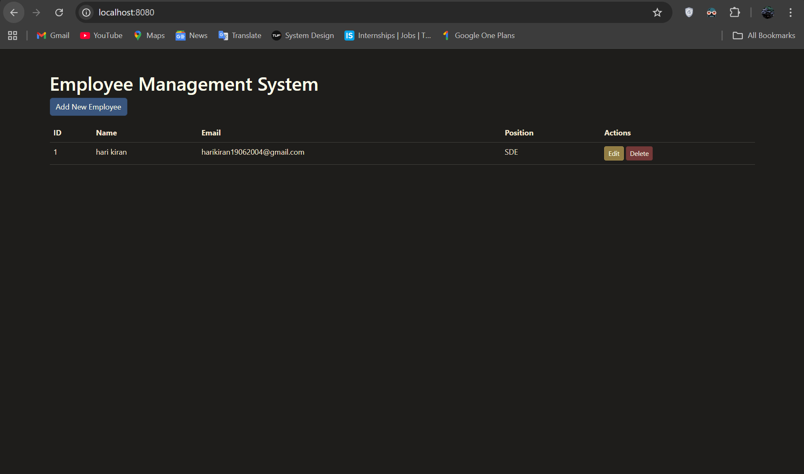
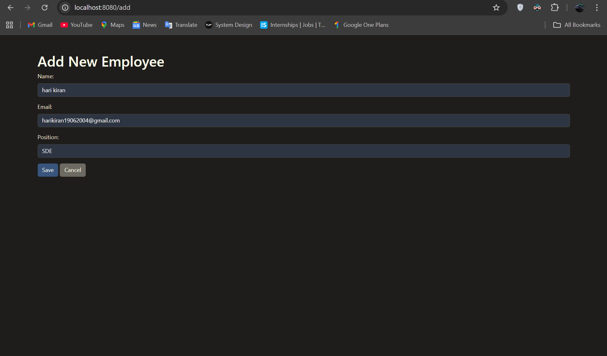
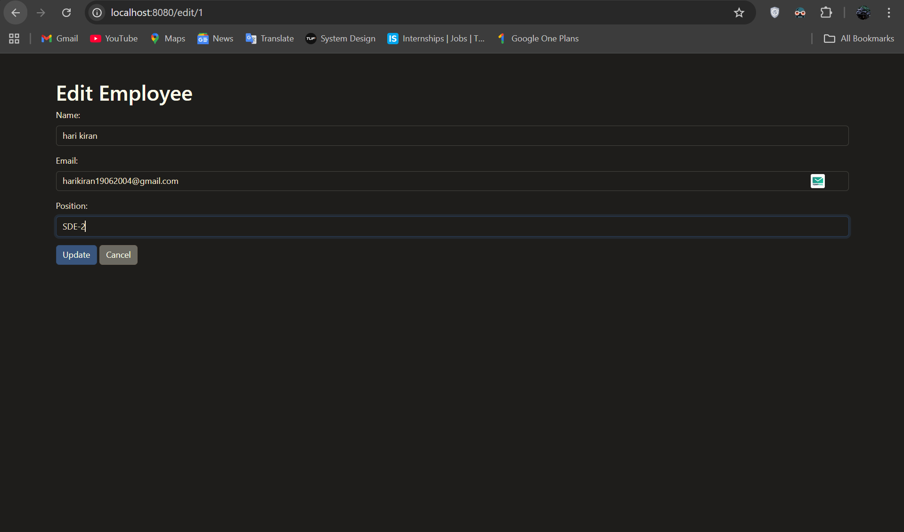

# Employee Management System

A Spring Boot application for managing employee records with basic CRUD operations.

## Technologies Used

- Spring Boot
- Spring Data JPA
- Thymeleaf
- H2 Database
- Maven

## Features

- View all employees
- Add new employee
- Edit existing employee
- Delete employee

## Screenshots

### Home Page - Employee List


### Add Employee Form


### Edit Employee Form


## Project Structure

```
src/
├── main/
│   ├── java/
│   │   └── com/example/demo/
│   │       ├── controller/
│   │       │   └── HomeController.java
│   │       ├── model/
│   │       │   └── Employee.java
│   │       ├── repository/
│   │       │   └── EmployeeRepository.java
│   │       └── DemoApplication.java
│   └── resources/
│       ├── templates/
│       │   ├── add.html
│       │   ├── edit.html
│       │   └── home.html
│       └── application.yaml
```

## Getting Started

1. Clone the repository:
   ```bash
   git clone https://github.com/Harihkvent/demo.git
   ```

2. Navigate to the project directory:
   ```bash
   cd demo
   ```

3. Run the application using Maven:
   ```bash
   ./mvnw spring-boot:run
   ```

4. Access the application in your web browser:
   ```
   http://localhost:8080
   ```

## API Endpoints

- `GET /` - View all employees
- `GET /add` - Show add employee form
- `POST /add` - Add a new employee
- `GET /edit/{id}` - Show edit employee form
- `POST /edit/{id}` - Update an employee
- `GET /delete/{id}` - Delete an employee

## Contributing

Feel free to fork the repository and submit pull requests.

## Test Results

Latest test execution results from the project:

```plaintext
-------------------------------------------------------------------------------
Test set: com.example.demo.DemoApplicationTests
-------------------------------------------------------------------------------
Tests run: 1, Failures: 0, Errors: 0, Skipped: 0, Time elapsed: 10.38 s
```

All tests are passing successfully, demonstrating the reliability of the application.

## Build Information

The project uses Maven for build management. Build artifacts are stored in the `target/` directory:
- Compiled classes: `target/classes/`
- Test results: `target/surefire-reports/`
- Packaged application: `target/demo-0.0.1-SNAPSHOT.jar`

## License

This project is open source and available under the [MIT License](LICENSE).
